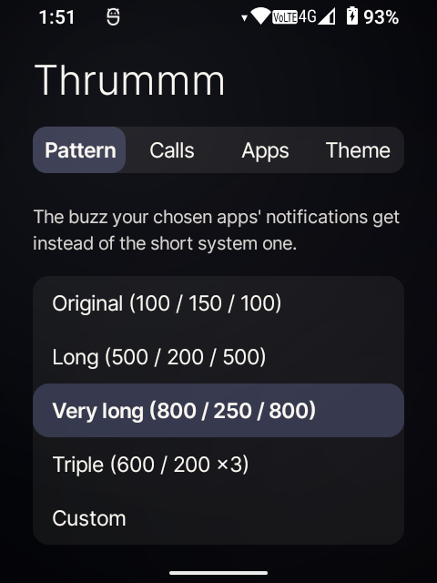
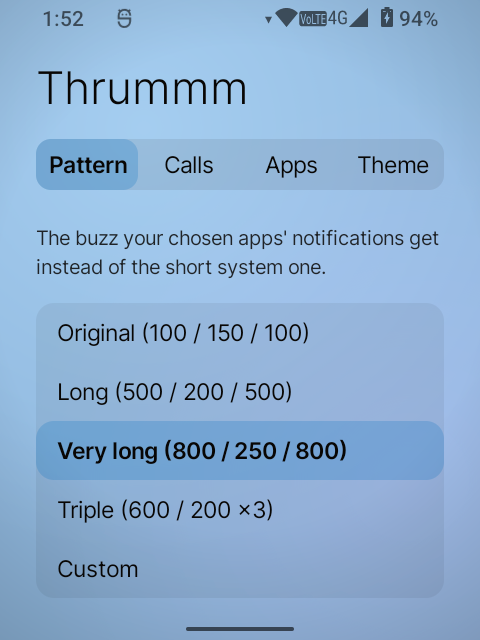
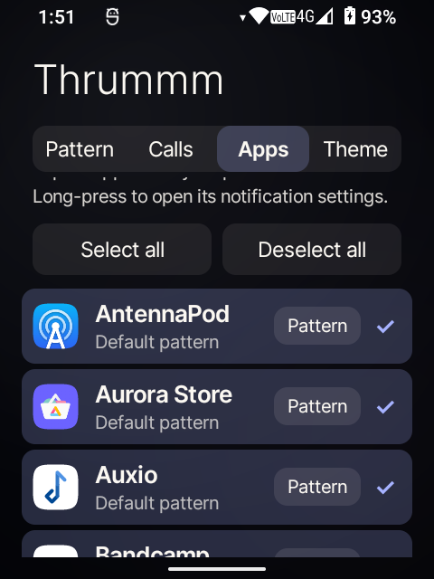
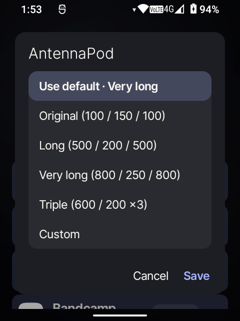
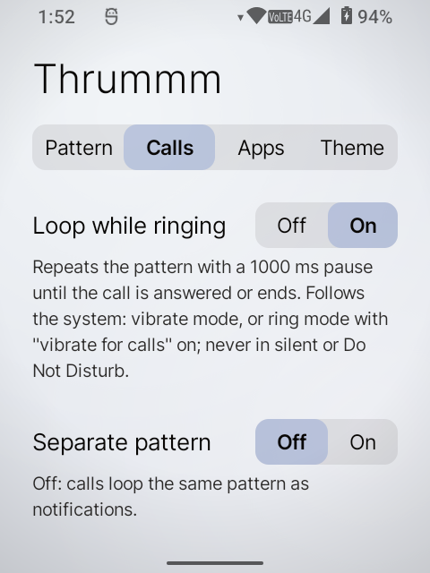
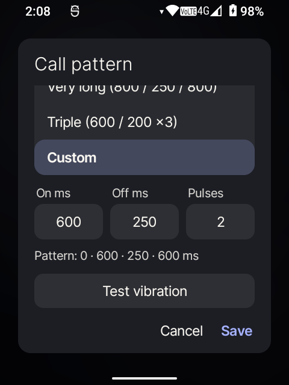
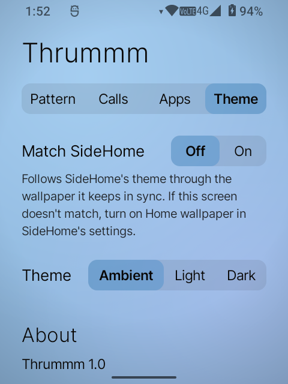
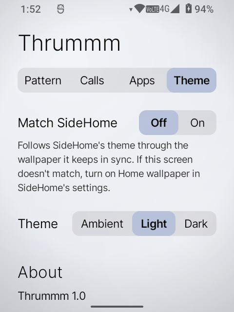
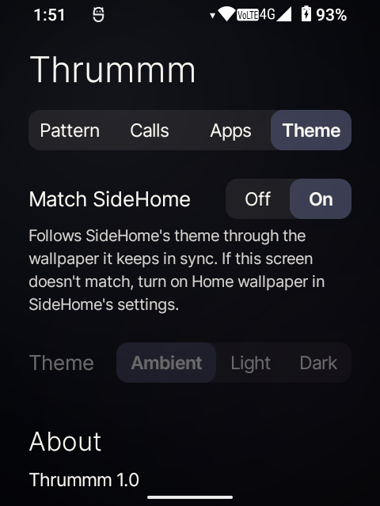
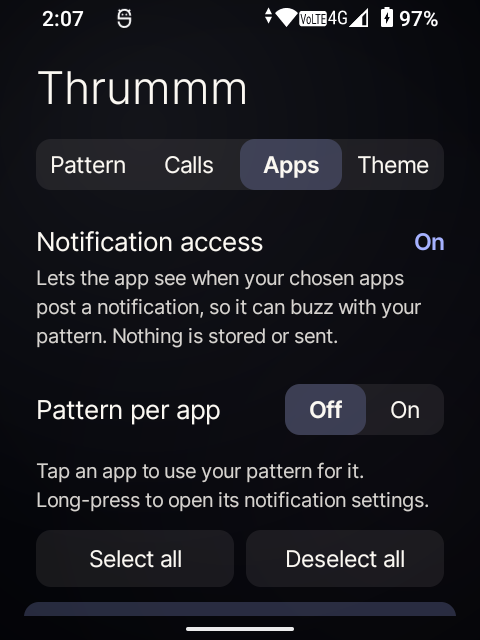

<p align="center">
  
  &nbsp;&nbsp;
  
</p>

# Thrummm

**Longer, stronger-feeling notification vibrations for the [Sidephone SP-01](https://sidephone.com):
buzzes you actually notice.**

<p align="center">
  
  &nbsp;
  
  &nbsp;
  
</p>

Thrummm replaces the faint stock notification buzz on the SP-01, a de-Googled AOSP phone,
with a vibration pattern you choose, for the apps you choose. It can also loop a pattern
while a call rings. It is small, needs no internet access, and borrows the calm look of
[SideSuite](https://github.com/side-suite).

> **In one sentence:** the SP-01's motor is too slow to feel the stock 100 ms pulses, so
> Thrummm plays longer ones.

---

## Contents

- [Why Thrummm](#why-thrummm)
- [What it does](#what-it-does)
- [Patterns](#patterns)
- [Themes](#themes)
- [Install](#install)
- [First-time setup](#first-time-setup)
- [Privacy & permissions](#privacy--permissions)
- [Known limitations](#known-limitations)
- [Status](#status)
- [For developers](#for-developers)
- [License](#license)
- [Credits](#credits)

---

## Why Thrummm

On the SP-01, notifications are easy to miss. The phone doesn't lack a setting. The cause is
the motor itself.

- **The motor is on/off only.** The vibrator reports no amplitude control
  (`dumpsys vibrator_manager` shows `mCapabilities=[]`), so every vibration already runs at full
  strength, and the system intensity settings can't make it stronger.
- **The stock pattern is too short.** Android's default notification vibration is 100 ms on,
  150 ms off, 100 ms on. The SP-01's small motor has to spin up before you can feel it, and
  100 ms ends before it gets going.
- **Longer pulses feel much stronger.** The dialer's missed-call pattern (350 / 250 / 350 ms)
  is noticeably easier to feel, and the ringtone's longer, ramped pulses are easier still.

So the fix is **longer pulses, not stronger ones**. Thrummm listens for notifications from the
apps you pick and plays your pattern.

---

## What it does

- **Your pattern, for the apps you pick.** Tick apps in a list. Their notifications get your
  pattern; every other app keeps the system default.
- **Presets and custom patterns.** Choose Long, Very long, Triple, or your own on / off / pulse
  count. Original (the stock pattern) is in the list too, so you can feel the difference.
  **Test vibration** plays any of them.
- **A pattern per app (optional).** Give a messaging app a stronger pattern than a podcast
  app. Off by default. When it's on, each ticked app gets a **Pattern** button, and any app
  can still follow the default.
- **No double buzz in vibrate mode.** In vibrate mode, Android plays its own short buzz in
  place of the notification sound, shortly after the notification arrives. Thrummm blocks that
  buzz so your pattern plays in full.
- **Loop a pattern while a call rings (optional).** It repeats with a one-second pause until
  you answer or the call ends. It follows the system's rules: always in vibrate mode, in ring
  mode only when "vibrate for calls" is on, and never in silent or Do Not Disturb. Calls can
  use their own pattern.
- **Stays quiet when it should.** It skips Do Not Disturb and silent mode. It ignores ongoing
  and foreground-service notifications (music players, downloads) and group summaries, and it
  buzzes once for repeat posts within two seconds.

<p align="center">
  
  &nbsp;&nbsp;
  
  &nbsp;&nbsp;
  
</p>
<p align="center"><em>Picking apps, a per-app pattern, and the call loop.</em></p>

---

## Patterns

Timings are in milliseconds: on / off / on…

| Preset | Pattern |
|---|---|
| **Original** | 100 / 150 / 100 (the stock pattern, for comparison) |
| **Long** | 500 / 200 / 500 |
| **Very long** | 800 / 250 / 800 |
| **Triple** | 600 / 200 / 600 / 200 / 600 |
| **Custom** | your on / off × pulses: 10–5000 ms on, 0–5000 ms off, 1–10 pulses |

<p align="center">
  
</p>
<p align="center"><em>A custom pattern, with a live readout and a test button.</em></p>

---

## Themes

The settings screen follows SideSuite's design: Inter type, soft pill controls, and a
background that tracks the time of day. Text and accent colours are always derived from the
background, so every combination stays readable.

- **Match SideHome** (on by default when SideHome is installed): follows SideHome's current
  theme. SideHome keeps its theme private, so Thrummm reads the colour of the wallpaper that
  SideHome's **Home wallpaper** sync keeps painted. If the colours don't match, turn that sync
  on in SideHome's settings.
- **Ambient:** a sky that moves from night navy through dawn rose, day blue, and dusk orange.
- **Light** and **Dark:** SideHome's "Full light" and "Full dark" colours.

<p align="center">
  
  &nbsp;&nbsp;
  
  &nbsp;&nbsp;
  
</p>
<p align="center"><em>Ambient, Light, and matching a dark SideHome.</em></p>

---

## Install

1. Get the APK: download it from [Releases](https://github.com/dnsmith124/thrummm/releases)
   (once published), or build it yourself (see [For developers](#for-developers)).
2. Install over USB:
   ```
   adb install -r app-release.apk
   ```
   or copy the APK to the phone and open it.

For update notifications, add this repo to **[Obtainium](https://github.com/ImranR98/Obtainium)**.

Requires Android 12 (API 31). It's designed for the SP-01's 480 × 640 screen and should work
on other Android 12+ phones.

---

## First-time setup

<p align="center">
  
</p>

1. Open Thrummm → **Apps** → tap **Notification access** and allow it on Android's page.
2. Tick the apps that should use your pattern, then pick a pattern on the **Pattern** tab.
3. *(Optional)* **Calls** → **Loop while ringing**. Android asks for the Phone permission.
4. *(Optional, ring mode)* If a ticked app's notifications also buzz on their own, turn off
   vibration for that app. Long-press it in Thrummm to open its notification settings. In
   vibrate mode, Thrummm handles this for you.

---

## Privacy & permissions

Thrummm has no network access, no analytics, no ads, and no accounts. It declares **no
`INTERNET` permission**, so it cannot send anything anywhere. Each permission below is tied to
a feature:

### Notification access (`BIND_NOTIFICATION_LISTENER_SERVICE`)

Android's only way for an app to learn that a notification arrived. Thrummm reads just three
things from each notification: **which app posted it**, its **flags** (to skip ongoing,
foreground-service and summary notifications), and its **key** (to spot a repeat post). It
never reads the title, text, sender, or any content, and stores nothing. The keys of recent
notifications are held in memory for a few seconds to catch duplicates, then dropped. Release
builds write nothing to the system log.

The system grant *is* the switch: revoke it on Android's page and Thrummm stops listening.

### `READ_PHONE_STATE`: optional, for the call loop only

Requested only when you turn on **Loop while ringing**. Android's prompt describes it as
"make and manage phone calls", but Thrummm only reads whether the phone is **ringing, in a
call, or idle**. It never sees numbers or contacts and can't place or answer calls.

### `QUERY_ALL_PACKAGES`: for the app list

Android 11+ hides installed apps from each other unless asked. Thrummm needs the full list
(names and icons) to show the app picker. The list stays on the phone.

### `VIBRATE`

To play your patterns.

---

## Known limitations

- **Silencing a ringing call with a volume key doesn't stop the loop.** Android handles that
  key itself and doesn't tell other apps. The loop stops when you answer or the call ends. (A
  workaround via Android's in-call service API was tried and didn't receive the event on the
  SP-01.)
- **A call may start with two faint ticks** from the system's own ringtone vibration, about
  half a second before Thrummm's pattern takes over.
- **Ring mode:** if a ticked app's notification channel is set to vibrate, you may feel its
  short buzz just before your pattern. Turn off that channel's vibration to avoid it.
- **Match SideHome** relies on SideHome's wallpaper sync. Without it, Thrummm matches whatever
  wallpaper you have.

---

## Status

**v1.0.** Running on an SP-01. All features were checked on the device, including
notification and call timing against the system's vibration history. There are no automated
tests yet.

---

## For developers

Thrummm is plain **Kotlin** with Android framework views: no Jetpack Compose, no AndroidX, and
no dependencies beyond the Kotlin standard library. `minSdk 31`, `targetSdk 33`.

### Build

Requires JDK 17 and the Android SDK (platform 34); Android Studio isn't needed.
`local.properties` should point at your SDK, e.g. `sdk.dir=/Users/you/Library/Android/sdk`.

```sh
./gradlew assembleDebug                       # debug build
adb install -r app/build/outputs/apk/debug/app-debug.apk

./gradlew assembleRelease                     # shrunk release build (~190 KB)
adb install -r app/build/outputs/apk/release/app-release.apk
```

Release builds are signed with your own key if `keystore.properties` exists (see
`keystore.properties.example`), otherwise with the debug key. The debug key lets a release
build install over a debug one without losing settings. Before distributing, create a real
key: updates must be signed with the same key.

The bundled Inter fonts are trimmed to Latin characters (about 77 KB each instead of 310 KB)
by `tools/subset-fonts.sh`. Other characters fall back to the system font.

### Source map

| File | What it does |
|---|---|
| `VibeListenerService.kt` | The notification listener and the call-state watcher. |
| `Buzzer.kt` | Plays patterns: the held notification buzz and the call loop. |
| `Prefs.kt` | Settings, presets, and the `PatternSpec` model. |
| `SettingsActivity.kt` | The tabbed settings screen. |
| `PatternEditor.kt` | The preset list, custom fields, and test button, shared by the screen and popups. |
| `Ui.kt` | Side-style view builders: type, pills, rows, the popup panel. |
| `Ambient.kt` | The theme palette: time-of-day sky, Light/Dark, Match SideHome. |
| `Oklch.kt` | OKLab/OKLCH colour conversion. |

### How it works

**Blocking the system's late buzz.** In vibrate mode, Android swaps each notification's sound
for a short fallback buzz (100 / 150 / 100). On the SP-01, the system's buzz starts about 480 ms *after* Thrummm's.
Normally the newer vibration wins, which cut Thrummm's pattern short. Android 12 won't let a
one-shot vibration interrupt a *repeating* one, so Thrummm ends its pattern with a silent
segment that repeats and cancels it after about two seconds. The system's buzz is then
dropped. The vibrator service's history confirms it:

```
12:52:47.371  thrummm   800/250/800 + silent tail   → cancelled by Thrummm after 2.005 s
12:52:47.845  android   100/150/100                 → ignored_for_ongoing
```

**Winning the ringtone race.** During a call, Telecom starts its own repeating ringtone
vibration, and whichever repeating vibration starts last wins. On the SP-01, Telecom's started
about 150 ms after the phone reported "ringing", replacing Thrummm's loop. Thrummm now starts
500 ms late and re-issues the loop at the start of every cycle's pause. You can't feel the
restart while Thrummm still has the vibrator, and if Telecom took over, Thrummm reclaims it
within one cycle:

```
12:57:56.267  telecom   ringtone ramp               → replaced after 469 ms
12:57:56.735  thrummm   800/250/800 + 1 s pause     → re-issued every 2.86 s until the call ended
```

**Matching SideHome.** SideHome stores its theme privately, but its wallpaper sync paints the
system wallpaper in the current theme. `WallpaperManager.getWallpaperColors()` needs no
permission, so Thrummm derives its palette from the wallpaper's primary colour. It uses the
same rule SideHome does: dark ink when the colour's OKLCH lightness is above 0.55.

To see what the vibrator is doing on a device:

```sh
adb shell dumpsys vibrator_manager      # current and recent vibrations, with status
adb logcat -s Thrummm                   # debug builds log each buzz
```

---

## License

Thrummm is free software under the **GNU General Public License v3.0 or later**; see
[`LICENSE`](LICENSE). You're free to use, study, share, and modify it; derivatives stay open
under the same license. It's similar to the license
[SideHome](https://github.com/side-suite/SideHome) uses.

The bundled [Inter](https://rsms.me/inter/) typeface is under the SIL Open Font License 1.1
([`app/src/main/assets/Inter-LICENSE.txt`](app/src/main/assets/Inter-LICENSE.txt)).

---

## Credits

- Built for the **[Sidephone SP-01](https://sidephone.com)**.
- Design inspired by **[SideSuite](https://github.com/side-suite)**, especially
  [SideHome](https://github.com/side-suite/SideHome): its type scale and pill controls. The
  palette values and the day-cycle approach are adapted from SideHome (GPL-3.0).
- Typeface: [Inter](https://rsms.me/inter/) by Rasmus Andersson.

*Thrummm is an independent project, not affiliated with Sidephone or SideSuite.*
